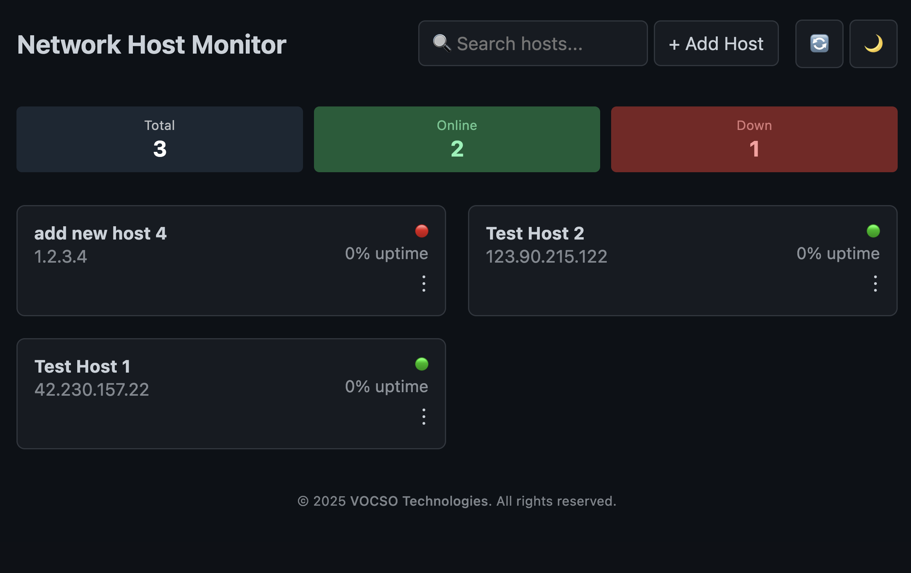

# 🖥️ Network Host Monitor

A self-hosted, lightweight monitoring tool for tracking the uptime and health of multiple network hosts (via IP). Designed to run on Raspberry Pi or other Linux machines with:

- ✅ Real-time dashboard via web UI
- ✅ Email alerts on downtime
- ✅ Persistent logging and host management
- ✅ Token-based protected API access
- ✅ Systemd service for auto-starting monitoring and UI

---

📸 UI Preview



---

## 📦 Features

- Monitor hosts by IP with friendly names
- View current status, uptime history, and statistics
- Add/edit/remove hosts from web UI
- Alert via email after defined failure threshold
- Fully customizable intervals and limits
- Secure access with token-based authentication
- Auto-start on reboot with systemd
- Built using Python, Flask, HTML, CSS, JS

---

## 🚀 Getting Started

### 1. Clone This Repo

```bash
git clone https://github.com/vocso/network-host-monitor.git
cd network-host-monitor
```

### 2. Install Python Dependencies

```bash
pip install flask
```

### 3. Configure

#### `config.json`

```json
{
  "auth_token": "changeme123",
  "email": {
    "sender": "sender@gmail.com",
    "password": "xxxx xxxx xxxx xxxx",
    "smtp_server": "smtp.gmail.com",
    "smtp_port": 587,
    "recipient": "alert_receiver@example.com"
  },
  "config": {
    "interval": 60,
    "max_failures": 10,
    "interval_failures_check": 1,
    "email_interval": 600
  }
}
```

#### `hosts.json`

```json
{
  "hosts": [
    {
      "id": 1234567890,
      "name": "My Server",
      "ip": "192.168.0.1",
      "statusCurrent": 1,
      "statusHistory": []
    }
  ]
}
```

---

## 🖥️ Running the Frontend UI

Run manually:

```bash
cd admin
python3 api.py
```

By default it runs at:

📍 `http://<your-ip>:5055/`

The page is protected. You’ll be prompted for an access token before loading the dashboard.

You can change the port in `api.py`.

---

## ⚙️ Setting Up systemd Services

### ✅ 1. Service for `pingmonitor.py`

Create a systemd service file:

```bash
sudo nano /etc/systemd/system/pingmonitor.service
```

Paste:

```ini
[Unit]
Description=Host Monitoring Service
After=network.target

[Service]
ExecStart=/usr/bin/python3 /home/pi/network-host-monitor/pingmonitor.py
WorkingDirectory=/home/pi/network-host-monitor
Restart=always
User=pi

[Install]
WantedBy=multi-user.target
```

✅ Replace `/home/pi/network-host-monitor/` with your actual path
✅ Replace `pi` with your system user if not using Raspberry Pi

Enable and start the service:

```bash
sudo systemctl daemon-reexec
sudo systemctl daemon-reload
sudo systemctl enable pingmonitor.service
sudo systemctl start pingmonitor.service
```

### ✅ 2. Service for `admin/api.py` (Flask UI)

```bash
sudo nano /etc/systemd/system/hostmonitor-ui.service
```

Paste:

```ini
[Unit]
Description=Host Monitor Admin Web UI
After=network.target

[Service]
ExecStart=/usr/bin/python3 /home/pi/network-host-monitor/admin/api.py
WorkingDirectory=/home/pi/network-host-monitor
Restart=always
User=pi

[Install]
WantedBy=multi-user.target
```

Enable and start:

```bash
sudo systemctl daemon-reload
sudo systemctl enable hostmonitor-ui.service
sudo systemctl start hostmonitor-ui.service
```

---

## 🧠 Optional: Auto-Open in Browser on Boot (Raspberry Pi GUI only)

```bash
nano ~/.config/lxsession/LXDE-pi/autostart
```

Add this line at the end:

```bash
@chromium-browser --app=http://localhost:5055
```

---

## 🔐 Authentication

This app uses token-based authentication.

You’ll be prompted for an access token when you open the UI.

The token must match `auth_token` in your `config.json`.

---

## ⚠️ Roadmap / TODO

- [ ] Persist and visualize last 24 status checks in dashboard
- [ ] Add user-based authentication (beyond token)
- [ ] Export logs and stats
- [x] Dark/light theme memory and switching (already works!)
